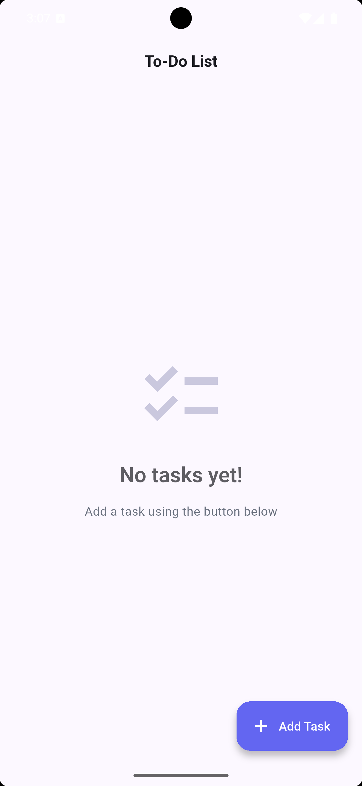
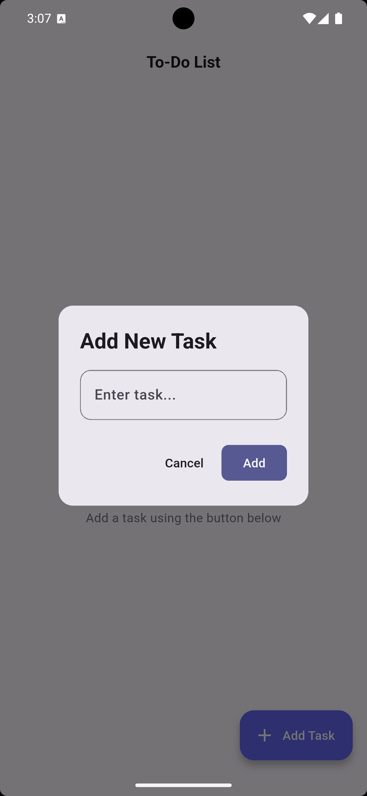
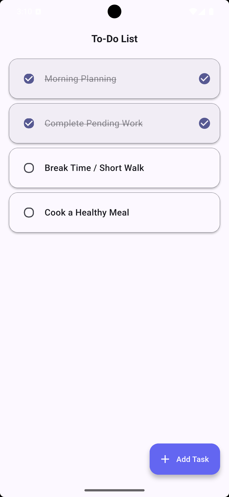
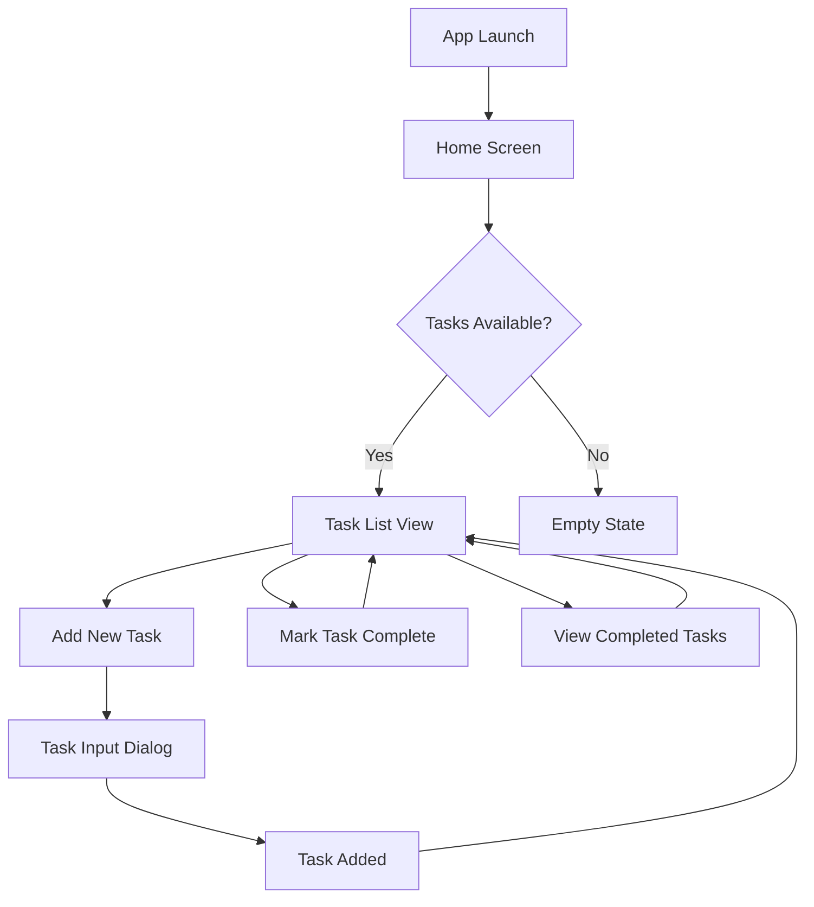

# To-Do List App

A modern, feature-rich to-do list application built with Flutter. This app provides a seamless task management experience with a clean, intuitive interface and beautiful UI design.

## 📱 Screenshots

<p align="center">
  
  
  
</p>

## 🌟 Features

- **Task Management**: Add, view, and manage your daily tasks
- **Task Completion**: Mark tasks as complete with visual feedback
- **Beautiful UI**: Modern Material Design 3 interface with smooth animations
- **Dark/Light Theme**: Automatic theme switching based on system preference
- **Responsive Design**: Works seamlessly on mobile, tablet, and desktop
- **Clean Architecture**: Well-structured code following best practices
- **Intuitive UX**: Simple and user-friendly interface

## 🛠️ Technologies & Packages

### Core Technologies
- **Flutter**: Cross-platform mobile development framework
- **Dart**: Programming language for Flutter
- **Material Design 3**: Modern UI design system

### Key Features
- **State Management**: Built-in Flutter state management
- **Responsive Layouts**: Adaptive UI for different screen sizes
- **Theme System**: Light and dark mode support
- **Custom Widgets**: Reusable UI components
- **Clean Architecture**: Modular project structure

## 🏗️ Architecture

The app follows a clean, modular architecture with clear separation of concerns:

```
lib/
├── constants/              # App-wide constants and assets
├── core/                   # Shared logic and utilities
│   ├── constants/          # App constants
│   ├── theme/              # App styling and themes
└── features/               # Feature-based modules
    └── todo/               # To-Do feature module
        ├── presentation/   # UI layer
        │   └── screens/    # Screen widgets
        ├── domain/         # Business logic layer
        │   ├── entities/   # Data models
        │   └── repositories/ # Repository interfaces
        └── data/           # Data layer
            └── repositories/ # Repository implementations
```

## 🔄 App Flow



## 🎨 UI/UX Design

### Color Palette
- **Primary Indigo**: `#6366F1` - Used for accents and primary actions
- **Secondary Violet**: `#8B5CF6` - Used for dark theme accents
- **White**: `#FFFFFF` - Background and clean elements
- **Dark Gray**: `#1F2937` - Primary text color
- **Light Gray**: `#6B7280` - Secondary text color

### Typography
- **Headline**: 24px, bold for main titles
- **Title**: 18px, semi-bold for section headers
- **Body**: 16px, medium weight for main content
- **Caption**: 14px, regular weight for secondary text

## 🚀 Getting Started

### Prerequisites
- Flutter SDK (3.0.0 or higher)
- Dart SDK
- Android Studio or VS Code
- Git

### Installation

1. Clone the repository:
   ```bash
   git clone https://github.com/your-username/to_do_list_app.git
   ```

2. Navigate to the project directory:
   ```bash
   cd to_do_list_app
   ```

3. Install dependencies:
   ```bash
   flutter pub get
   ```

4. Run the app:
   ```bash
   flutter run
   ```

## 📁 Project Structure

The app follows a feature-first architecture where the to-do functionality is organized in its own directory under `lib/features/todo/`:

```
features/todo/
├── presentation/           # UI layer
│   └── screens/            # Screen widgets
│       └── todo_list_screen.dart    # Main to-do list screen
├── domain/                 # Business logic layer
│   ├── entities/           # Data models
│   │   └── todo_item.dart  # To-do item model
│   └── repositories/       # Repository interfaces
│       └── todo_repository.dart     # Repository interface
└── data/                   # Data layer
    └── repositories/       # Repository implementations
        └── todo_repository_impl.dart # Repository implementation
```

## 🧪 Testing

The app includes:
- Unit tests for business logic
- Widget tests for UI components
- Integration tests for critical user flows

To run tests:
```bash
flutter test
```

## 🤝 Contributing

1. Fork the repository
2. Create a feature branch (`git checkout -b feature/AmazingFeature`)
3. Commit your changes (`git commit -m 'Add some AmazingFeature'`)
4. Push to the branch (`git push origin feature/AmazingFeature`)
5. Open a pull request

## 📄 License

This project is licensed under the MIT License - see the [LICENSE](LICENSE) file for details.

## 🙏 Acknowledgements

- [Flutter](https://flutter.dev/)
- [Material Design](https://material.io/)
- [Dart](https://dart.dev/)